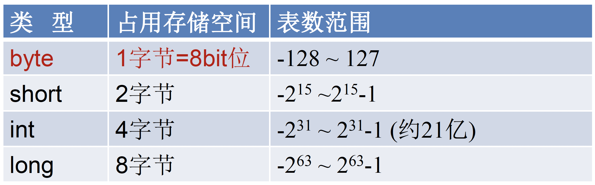
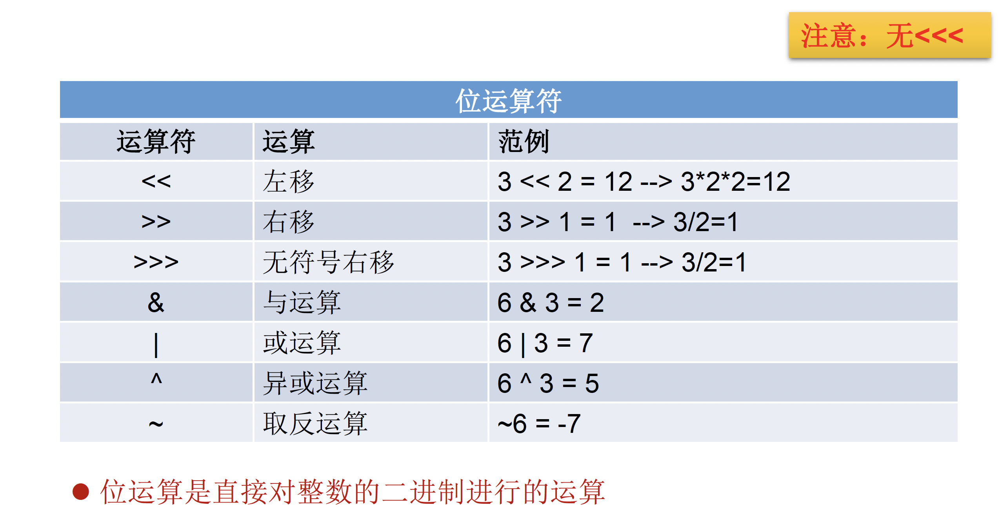

## Java学习笔记

by：白白子


### Java语言的特点

#### 面向对象

- 基本概念：类class、对象obj
- 三大特征：封装、继承、多肽

#### 健壮性

- 去掉C/C++的指针，内存申请与释放，提供相对安全的内存管理和访问机制

#### 跨平台性

- 通过Java编写的程序可以在不同的系统平台上运行
- 原理：通过JVM


### Java语言的环境搭建

#### JDK: Java Developer Kit

包含Java开发工具和JRE

#### JRE: Java Runtime Environment

包含JVM和Java SE 标准类库


### Java基本语法01：变量与运算符

#### 关键字keyword与保留字reserved word

- Keyword：被Java语言赋予了特殊含义，用作专门用途的字符串
- 关键字所有字母都是==小写==的

用于定义数据类型的关键字：

| class   | interface | enum  | byte   | short |
| :------ | :-------- | ----- | ------ | ----- |
| int     | long      | float | double | char  |
| boolean | void      |       |        |       |

用于定义流程控制的关键字：

| if     | else | switch | case  | default  |
| :----- | ---- | ------ | ----- | -------- |
| while  | do   | for    | break | continue |
| return |      |        |       |          |

用于定义访问权限修饰符的关键字：

| private | Public | pr   |      |      |
| ------- | ------ | ---- | ---- | ---- |

- Reserved Word：现有Java尚未使用，在以后的版本可能会作为关键字使用 goto/const

#### 标识符Identifier

- Java对各种变量、方法、类等要素命名时使用的字符序列成为标识符（凡是可以自己起名的地方都是标识符）

```java
/*
标识符的使用
1. 标识符：凡是可以自己起名的地方都是标识符
	 比如：类名、变量名、方法名、接口名、包名....

2. 标识符的命名规则
>	由26个英文字母大小写，0-9 ，_或 $ 组成
>	数字不可以开头。
>	不可以使用关键字和保留字，但能包含关键字和保留字。
>	Java中严格区分大小写，长度无限制。
>	标识符不能包含空格。
*/
class IdentifierTest{
  public static void main(String[] args) {
    
  }
}
```


- Java中的名称命名规范
  - 包名：多单词组成时所有字母都小写：xxxyyyzzz
  - 类名、接口名：多单词组成时，所有单词的首字母大写：XxxYyyZzz
  - 变量名、方法名：多单词组成时，第一个单词首字母小写，第二个单词开始每个单词首字母大写：xxxYyyZzz
  - 常量名：所有字母都大写。多单词时每个单词用下划线连接：XXX_YYY_ZZZ

#### 变量

- 内存中的一个存储区域
- 该区域的数据可以在同一类型范围内不断变化
- 是程序中最基本的存储单元，包含==变量类型、变量名和存储的值== (<==强类型)
- 变量的作用：用于在内存中保存数据
- 使用变量需要注意：
  - ==Java中每个变量必须先声明，后使用==
  - 使用变量名来访问这块区域的数据
  - 变量的作用域：其定义所在的一对{ }内
  - 变量只有在其作用域内才有效
  - 同一个作用域内，不能定义重名的变量

- 变量类型
  - 变量按照==数据类型==来分
    - 基本数据类型 Primitive Type, 共8种
      - 数值型
        - 整数类型 byte, short, int, long
        - 浮点数类型 float, double
      - 字符型 char(character)
      - 布尔型 boolean
    - 引用数据类型 Reference Type，==引用数据类型初始化需要使用new==
      - 类 class <== ==字符串 String==在这里
      - 接口 interface
      - 数组 array []
  - 变量按照在类中声明位置来分
    - 成员变量
    - 局部变量
- 整数类型: byte, short, int, long
  - Java中整型常量默认为int
  - 声明long必须后面加“l”
  - 变量通常为int，除非不足以表示较大的数，才使用long

```java
short s1 = 128;
int i1 = 1234;
long l1 = 4623786497126479126L;
```



- 浮点数类型：float, double
  - float:单精度，尾数可以精确到7位有效数字。很多情况下，精度很难满足需求
  - double:双精度，精度是float的两倍。通常采用此类型
  - ==Java 的浮点型常量默认为double型，声明float型常量，须后加‘f’或‘F’==

```java
float f1 = 12.3F; // 编译后不出现F
double d1 = 123.1; // 通常用double不用float
```


- 字符类型：char

  - 1字符 = 2bytes = 16bits

  - 字符串内部只能写==一个字符==

  - ```java
    char c1 = 'a'; // 只能写一个字符
    ```

  - 转义字符：“\\", 将其后的字符转变为特殊字符型常量(反转义：\\\n ==> 输出\\n)

  - Unicode编码集：\uxxxx

  - ```java
    char c2 = '\n'; // 换行符
    char c3 = '\u0043'; // Unicode
    ```


- 布尔类型：Boolean

  - 用来判断逻辑条件，只有true和false

  - ```java
    boolean bb1 = true;
    boolean bb2 = false;
    ```

  - 布尔型变量==没有null==

- 基本数据类型转换(前提：不包含boolean类型)

  - 自动类型提升：：容量小的类型自动转换为容量大的数据类型

    - 

    - Example：

      - ```java
        byte b1 = 2;
        int i1 = 129;
        byte b2 = b1 + i1; // 编译不通过，因为int容量大于byte
        
        int i2 = b1 + i1;
        long l1 = b1 + 11;
        float f = b1 + i1;
        
        short s1 = 123;
        double d1 = s1;
        System.out.println(d1); // 123.0
        
        //********************************
        char c1 = 'a'; // a = 97
        int i3 = 10;
        int i4 = c1 + i3;
        System.out.println(i4); // 107
        ```

  - 强制类型转换：自动类型提升的逆运算

    - 强制类型转换可能会导致精度损失

    - Example

      - ```java
        double d1 = 12.3;
        int i1 = d1; // 此时必须使用强转符
        int i1 = (int)d1; // 截断操作
        System.out.println(i1); // 12 ->损失精度
        ```

  - 特殊情况：编码情况

    - ```java
      // 编码情况1
      long l = 123213;
      System.out.println(l);
      // 编译失败：过大的整数
      // long l1 = 4678164712647912647891264791;
      // 应该使用：
      long l1 = 4678164712647912647891264791L;
      
      float f1 = 12.3; // 编译错误
      float f1 = (Float)12.3;
      
      // 编码情况2
      // 整数型常量默认是int
      byte b = 12;
      byte b1 = b + 1; // 编译错误，将byte和int相加
      ```

- 字符串类型：String

  - ==不是基本数据类型==，而是引用数据类型

  - 声明String类型变量时，使用一对==双引号” “==

  - ```
    String str = "Hello World";
    ```

  - String可以和8种基本数据类型做运算，且运算只能是连接运算‘+’，运算结果也是String类型

  - ```java
    int number = 1001;
    String numberStr = "学号：";
    String info = numberStr + number; // Info的类型是String
    ```

字符串练习1：

```java
char c = 'a'; // a = 97
int num = 10;
String str = "hello";
System.out.println(c + num + str); // 107hello, 因为c和num先做加法，之后整体和str连接
System.out.println(c + str + num); // ahello10
```

字符串练习2：希望控制台输出：```* *```

```java
System.out.println("*	*");
System.out.println('*' + '\t' + '*'); // 93 做加法运算
System.out.println('*' + "\t" + '*');
System.out.println('*' + '\t' + "*"); // 51* 做加法之后连接
System.out.println('*' + ('\t' + "*"));
```


#### 运算符

- 位运算符

  - 

- 三元运算符

  - 格式：`(条件表达式)? 表达式1:表达式2;`, 如果条件位true，运算后结果位表达式1，反之则为2

  - 条件表达式的结果为布尔类型

  - ```java
    int m = 12;
    int n = 5;
    int max = (m > n)? m : n; // max的类型只要提升就可以 例如 double max = (m > n)? 1 : 2.0;
    System.out.println(max);
    ```

#### 程序流程控制

- 顺序结构：程序从上到下逐行执行，中间没有任何判断和跳转
- 分支结构：根据条件，选择性的执行某段代码
  - `if ... else`
  - `switch ... else`
- 循环结构：根据循环条件，重复性的执行某段代码
  - `while`
  - `do ... while`
  - `for`
- 特殊关键字：break和continue
  - break使用在switch-case或者循环结构中
    - 结束当前循环，跳出当前循环体
  - continue使用在循环结构中
    - 结束当次循环，跳至下次循环


### 分支语句（条件语句）

- If-else结构

  - if语句的三种格式
    - `if(条件为true){...}; //仅只有在条件位True的时候才会执行`
    - `if(条件为true){.操作1.}; else{.操作2.}; //如果位true会执行操作1；否则执行操作2`
    - `if(条件为true){.操作1.}; else if(条件为true){.操作2.} else{.操作3.};`

- 键盘读取 Scanner

  - 具体步骤：
    1. 导入包：`import java.util.Scanner;`
    2. Scanner的实例化(创建实例对象)：`Scanner <name> = new Scanner(System.in);`
    3. 调取Scanner类的相关方法，来获取指定类型的变量

- Switch-case结构

  - ```java
    switch(表达式){
      case 常量1:
        执行语句1;
      case 常量2:
        执行语句2;
      default:
        执行语句n;
    }
    ```

  - 关键字break：一旦遇到此关键字就调出switch结构
  - 表达式只能为以下类型：byte, short, char, int, 枚举类型, String类型


### 循环结构

- 循环条件的四要素
  1. 初始化条件
  2. 循环条件 ==> 是boolean类型
  3. 循环体
  4. 迭代条件

- 循环语句分类
  - for循环
    - 
  - while循环
    - 
  - do-while循环
    - 先执行再判断，且最少执行一次才会跳出循环体

### 数组 Array

- 数组的==特点==：
  - 数组是有序排列的
  - 是多个相同类型的数据按照一定顺序排列的集合，并通过编号的方式进行统一管理
  - 数组的本身是引用数据类型，数组中的元素可以为任意数据类型
  - 创建数组的对象会在内存中开辟一==整块连续的==空间（不连续的为链表）
  - 数组的长度一旦确定不可更改
- 数组的分类
  - 按照维数：一维数组，二维数组....
  - 按照数组元素类型：基本数据类型，引用数据类型

#### 一维数组

1. 一维数组的声明和初始化

   - ```java
     // 静态初始化：数组的初始化和赋值同时进行
     int[] ids; //一维数组的声明
     ids = new int[]{1001,1002,1003,1004}; //一维数组的初始化，因为是引用数据类型，所以是用new进行初始化
     // 动态初始化：数组的初始化和赋值不同时进行
     String[] names = new String[5]; // 要给出长度为5
     int[] arr01 = new int[100];
     // 数组一旦初始化完成其长度就确定了
     ```

2. 如何调用数组的指定位置的元素

   - 通过角标/索引的方式进行调用
   - 数组的角标从0开始，到数组的长度-1结束(ArrayLenth - 1)，例如长度为4，只有0 1 2 3 4 这五个元素

3. 如何获取数组的长度

   - 借助数组的属性：length

   - ```java
     String[] names = new String[5];
     int length = names.length;
     ```

4. 如何遍历数组

   - 借助循环结构

   - ```java
     for(int i = 0; i < names.length; i++) {
     	System.out.println(names[i]);
     }
     ```

5. 数组元素的默认初始化值

   - Byte, short, int, long 默认初始化值都是0
   - Float, double 默认初始化值都是0.0
   - Char 默认初始化值是0或者'\u0000' (不是‘0’)
   - Boolean 默认初始化值是false
   - 引用数据类型String 默认初始化是null

6. 数组的内存解析


- 放在方法中的变量叫做局部变量

#### 数组中涉及到的常见算法(p158-p173)

1. 数组元素的复制

---

### 面向对象编程

例子：人把大象装进冰箱

面向过程：1. 把冰箱打开  2. 抬起大象塞进冰箱  3. 关闭冰箱门

面向对象：

```Java
人{
	打开(冰箱){
		冰箱.开开();
	}
	
	抬起(大象){
		大象.进入(冰箱);
	}
	关闭(冰箱){
		冰箱.关闭();
	}
}

冰箱{
	开开(){};
	关闭(){};
}

大象{
	进入(冰箱){};
}
```


- 面向对象(Object Oriented Programming)：将功能封装进对象，强调具备了功能的对象，以class/object为最小单位，考虑谁来做

- 三大特征
  - 封装 Encapsulation
  - 继承 Inheritance
  - 多态 Polymorphism

- 面向过程(Procedure Oriented Programming)：强调的是功能行为，以函数为最小单位，考虑怎么做

- ==面向对象分析方法分析问题的思路和步骤==
  - 根据问题需要，选择问题所针对的现实世界中的实体
  - 从实体中寻找解决问题相关的属性和功能，这些属性和功能就形成了概念世界中的类
  - 把抽象的实体用计算机语言进行描述，形成计算机世界中类的定义。即借助某种程序语言，把类构造成计算机能够识别和处理的数据结构
  - 将类实例化成计算机世界中的对象。对象是计算机世界中解决问题的最终工具
- 核心：类和对象(==重点：类的设计==)
  - 类 class：对一类事物的描述，是抽象的、概念上的定义
    - 属性field：类中的成员变量 ==属性=成员变量=field=域=字段==
    - 方法method：类中的成员方法 ==方法=成员方法=函数=method==
  - 对象 object：是实际存在的该类事物的每个个体，也成为实例(instance)
  - 例子：类=抽象概念的人；对象=实实在在的某个人

Example01：定义Person类

```java
class Person{
    //属性
    String name;
    int age = 1;
    boolean isMale;
    //方法
    public void eat(){
        System.out.println("eating");
    }
    public void sleep(){
        System.out.println("sleeping");
    }
    public void talking(String language){
        System.out.println("talking in " + language);
    }
}
```

Example02：创建Person类的对象

```Java
public class PersonTest {
    public static void main(String[] args) {
        // 创建Person类的对象
        Person p1 = new Person();
        // 调用对象的属性: 对象.属性
        p1.name = "Tom";
        p1.isMale = true;
        System.out.println(p1.name);
        // 调用对象的方法: 对象.方法
        p1.eat();
        p1.sleep();
        p1.talking("Chinese");
        // *************************************************************
        Person p2 = new Person();
        System.out.println(p2.name); // 未给p2赋值，所以默认为null
        // *************************************************************
        // 将p1变量保存的对象的地址值赋给p3，导致p1和p3指向了堆空间中的同一个对象实体
        Person p3 = p1;
        System.out.println(p3.name);
    }
}
```

- [Line14-15] 如果创建了一个class的多个对象，则每个对象都独立拥有一套class的属性 ==> 非static
- [Line18] 将p1变量保存的对象的地址值赋给p3，导致p1和p3指向了堆空间中的同一个对象实体

#### 内存解析


- 堆(Heap)：此内存区域的唯一目的就是==存放对象实例==，几乎所有的对象实例都在这里分配内存。这一点在Java虚拟机规范中的描述是：所有的对象实例以及数组都要在堆上分配。
- 栈(Stack)：是指==虚拟机栈==。虚拟机栈用于==存储局部变量==等。局部变量表存放了编译期可知长度的各种基本数据类型(boolean, byte, char, short, int, float, long, double), 对象引用(reference类型，它不等同于对象本身，是对象在堆内存的首地址)。 方法执行完，自动释放。
- 方法区(Method Area)：用于存储已被虚拟机加载的==类信息、常量、静态变量、即时编译器编译后的代码==等数据。


### 属性与局部变量

```java
class User{
	// 属性or成员变量
	String name;
	int age;
	boolean isMale;
	
	public void talk(String language){ //language:形参，属于局部变量
	System.out.println("我们使用 " + language);
	}
  
  public void eat(){
    String food = "烙饼"; //局部变量
    System.out.println("北方人喜欢吃 " + food);
  }
}
```


- 成员变量(属性) vs 局部变量
  - 相同点：
    - 定义变量的格式：`数据类型 变量名 = 变量值`
    - 先声明，后使用
    - 变量都有其对应的作用域
  - 不同点
    - 在类中声明的位置的不同
      - 属性：直接定义在class的一对{}中
      - 局部变量：声明在方法内、方法形参、代码块内、构造器形参、构造器内部
    - ==权限修饰符==的不同
      - 属性：在声明属性时指明其权限，使用权限修饰符
        - **封装性：**常用的权限修饰符：`private, public, protected or 省略`
        - 体现结构被调用性的可见性的大小
      - 局部变量：不可以使用权限修饰符
    - 默认初始化值不同
      - 属性：有初始化值，根据其类型
        - 整型(byte, short, int, long)：默认初始化值是0
        - 浮点型(float, double)：默认初始化值是0
        - 字符型(char)：默认初始化值是0 or ('\u0000')
        - 布尔型(boolean)：默认初始化值是false
        - ==引用数据类型==(class, interface, array)：null
      - 局部变量：没有默认初始化值(在调用局部变量之前一定要显示初始化值)
        - 形参在调用时才会初始化`user.talk("Japanese");`
    - 在内存中加载的位置不同
      - 属性：加载到堆空间Heap (非Static)
      - 局部变量：加载到栈空间Stack (非Static)

- 类中方法的声明和使用

  - 方法method：描述class应该具有的功能

    - Example:

      - Math类：`sqrt(), random(), ...`
      - Scanner类：`nextXxx()...`
      - Arrays类：`sort(), binarySearch(), toString(), equals()...`

    - Example：

      - ```java
        // void: 没有返回值
        public void eat(){}
        public void sleep(int hour){}
        // String: 需要返回一个字符串
        public String getName(){}
        public String getNation(String nation){}
        ```

  - ==method声明方式==
    - `权限修饰符+返回值类型+方法名(形参列表){ 方法体; }`
    -   `public   String  getNation(String nation){}`
    - 特殊修饰方法：`static, final, abstract`
  
  - 需要注意的几点
  
    - 关于权限修饰符：(Java规定的四种修饰符`private, public, protected or 省略`)
      - private私有变量：
    - 关于返回值类型：
      - 如果方法有返回值，则==必须==在方法声明时提供返回值的类型，同时，==方法中需要使用return关键字来返回指定类型的变量或者常量==
      - 如果方法没有返回值，则方法声明时必须使用void，不需要使用return，return在void中表示结束方法 
  
    - 方法名：属于标识符，遵循标识符的规则和规范
  
    - 形参列表：方法可以不声明或声明1个或多个形参
      - 声明格式：`(数据类型1 形参1, 数据类型2 形参2)`
  
      - 什么时候该定义形参？按照UML Diagram
  
    - 方法体：方法功能的实现
  - return关键字的使用：
    - 适用范围：使用在方法体中
    - 作用
      1. 结束方法
      2. 针对于有返回值类型的方法：使用"return + 数据"方法，返回需要的数据
    - 注意点：return关键字后面不可以声明执行语句
  - method的使用
    - 可以调用当前class的属性以及方法
    - 特殊方法：方法A中调用方法A：递归方法


### “万事万物皆对象”

- 在Java中，都将功能、结构等封装到class中，通过class的实例化来调用具体的功能结构
- 在Java与其他语言交互时体现为class或者instance


### 匿名对象：在创建对象时没有显性赋值

```Java
new Phone().price = 1999; // price = 1999
new Phone().showPrice(); // output = 0
```

- 特征：匿名对象只能调用一次
- 匿名对象的使用：

```java
public static void main(String[] args){
  PhoneMall mall = new PhoneMall;
  mall.show(new Phone()); // ==>匿名对象的使用，可以用两次
}

class PhoneMall{
	public void show(Phone phone){
		phone.sendEmail();
		phone.playGame();
		}
}
```


### Example：自定义数组的工具类

```java
// Main Method
public class ArrayUtilTest {
    public static void main(String[] args) {
        ArrayUtil util = new ArrayUtil();
        int[] arr = new int[] {23, 18, 67, 8, 17, 38, 87, 76, 47, -6, -77};
        int max = util.getMax(arr);
        System.out.println("最大值是：" + max);

        System.out.println("排序前：");
        util.print(arr);

        util.sort(arr);
        System.out.println("排序后：");
        util.print(arr);

        System.out.print("Searching index: ");
        int index = util.getIndex(arr, -6);
        if (index > 0) {
            System.out.println("Find it!");
        } else System.out.println("Not find :(");
    }
}

// 自定义数组的工具类, class and method
public class ArrayUtil {

    // 求最大值
    public int getMax(int[] arr){
        int maxValue = 0;
        for (int i = 0; i < arr.length; i++){
            if (arr[i] > maxValue) {
                maxValue = arr[i];
            }
        }
        return maxValue;
    }

    // 求最小值
    public int getMix(int[] arr){
        int minValue = arr[0];
        for (int i = 1; i < arr.length; i++){
            if (arr[i] > minValue) {
                minValue = arr[i];
            }
        }
        return minValue;
    }

    // 求和
    public int getSum(int[] arr){
        int sum = 0;
        for (int i = 0; i < arr.length; i++) {
            sum += arr[i];
        }
        return sum;
    }

    // 求平均值
    public int getAve(int[] arr){
        return (getSum(arr) / arr.length);
    }

    // 反转数组
    public void reverse(int[] arr){
        int[] result = new int[arr.length];
        int j = 0;
        for (int i = arr.length-1; i > 0; i--){
            result[j] = arr[i];
            j++;
        }
        arr = result;
    }

    // 复制数组
    public int[] copy(int[] arr){
        int[] result = new int[arr.length];
        for (int i = 0; i < arr.length; i++) {
            result[i] = arr[i];
        }
        return result;
    }

    // 数组排序
    public void sort(int[] arr){
        System.out.println("排好啦只是没写代码");
    }

    // 遍历数组
    public void print(int[] arr){
        for (int i = 0; i < arr.length; i++){
            System.out.println(arr[i] + "\t");
        }
    }

    // 查找指定元素
    public int getIndex(int[] arr, int dest){
        for (int i = 0; i < arr.length; i++){
            if (dest == arr[i]) {
                return i;
            }
        }
        return -1;
    }
}
```


### ==Method Overload 重载方法==

- 在同一个类中，允许存在一个以上的同名方法，只要参数个数或者参数类型不同

```java
// 这两个method构成重载
public void reverse(int[] arr){}
public void reverse(String[] arr){}
```

- 相同点：class名称，method名称
- 不同点：参数类型不同，参数个数不同

Example：

```java
// 以下四个method构成重载
public void getSum(int i, int j) {}
public void getSum(double d1, double d2) {}
public void getSum(String s, int i) {}
public void getSum(int i, String s) {}

// 以下三个method与第一个不构成重载
// public int getSum(int i, int j) {return 0;}
// 
// public void getSum(int m, int n) {}
//
// private void getSum(int m, int n) {}
```

- 判断方法：跟method的权限修饰符(`public/private...`)，返回值类型(`int, double, void...`)，形参变量名(`(int i, int j)与(int m, int n)`)，以及方法体都没有关系
- Java选择重载方法符合自动类型提升

```java
public class OverLoadTest {
    public static void main(String[] args) {
        OverLoadTest test = new OverLoadTest();
        test.getSum(1, 2); // 自动选择1, 如果1被注释掉会选择2
    }

    public void getSum(int i, int j) {
        System.out.println("1");
    }

    public void getSum(double d1, double d2) {
        System.out.println("2");
    }

    public void getSum(String s, int i) {
        System.out.println("3");
    }

    public void getSum(int i, String s) {
        System.out.println("4");
    }
```

- 在通过对象调用方法时，如何确定要调用某一个同名方法？
  - 方法名 ==> 参数列表

### 可变个数形参的方法

在JDK5.0的时候加入了Varargs(Variable Numbers of Arguements)机制，允许==**直接定义能和多个实参相匹配的形参**==

Example：MethodArgsTest

```java
public class MethodArgsTest {
    public static void main(String[] args) {
        MethodArgsTest test = new MethodArgsTest();
        test.show(12); // 匹配method1
        test.show("Hello"); // 匹配method2
        test.show("Hello", "World!"); //可变形参
    }
    
    public void show(int i) { }
    public void show(String s) { }
    // 可变形参
    public void show(String ... s){ }
    // 此方法与上面的方法不构成重载，编译器报错
    public void show(String[] strs){ }
}
```

- 当调用可变个数形参的方法时，传入的参数个数可以是0个、1个、2个或者多个
- 可变个数形参的方法，==与其他方法名相同，形参类型相同的非数组方法之间构成重载==
- 方法名相同但参数类型也相同的数组之间不构成重载


### ==**方法参数的值传递机制**==

Example:

```java
public class ValueTransfer {
    public static void main(String[] args) {
        Order o1 = new Order();
        o1.orderId = 1001;
        Order o2 = o1; // 此时没有生成新对象, 只是把o1.orderId的地址给了o2, o1和o2都指向了堆空间的同一个实体
      
        System.out.println("o1 id:" + o1.orderId + "\n" + "o2 id:" + o2.orderId); 
// o1 id:1001
// o2 id:1001
        o2.orderId = 1002; 
        System.out.println("o1 id:" + o1.orderId + "\n" + "o2 id:" + o2.orderId);
// o1 id:1002
// o2 id:1002
    }
}

class Order{ int orderId; }
```

- 值传递机制

  - 如果参数是基本数据类型：此时实参赋给形参的是实参真实存储的数据值
  - ==**如果参数是引用数据类型：此时实参赋给形参的是实参存储数据的地址值**==
- 参数类型

  - 形参：方法定义时，声明的小括号内的参数 `public void aaa(int c)`

  - 实参：方法调用时，实际传递给形参的数据 `aaa(19)`

### 递归方法 Recursion

- 一个方法体内调用他自身
  - 方法递归包含了一种隐式的循环，它会重复执行某段代码，但这种重复执行无须循环控制

```java
// 计算从1到自然数n的和
public int getSum(int n){
	if(n == 1){
		return 1;
	} else {
		return n + getSum(n-1);
	}
}
```

### 面向对象的特征

#### 特征一：封装性

- 隐藏对象内部的复杂性，只对外公开简单的接口，便于外界调用，从而提高系统的可扩展性、可维护性
- **"高内聚，低耦合"**
  - 高内聚 ：类的内部数据操作细节自己完成，不允许外部干涉
  - 低耦合 ：仅对外暴露少量的方法用于使用
- 封装性的体现：
  1. `private`
  2. 不对外暴露的私有方法
  3. 单例模式 Singleton

Example: AnimalTest

```Java
package Day10;

public class AnimalTest {
    public static void main(String[] args) {
        Animal a = new Animal();
        a.name = "大黄";
        a.age = 1;
        a.legs = 4; // 由于legs的权限是private，所以这里不可以直接赋值，必须使用给定的setLegs方法

        //a.legs = -4;
        a.setLegs(6);
        a.show();
    }
}

class Animal{
    String name;
    int age;
    private int legs; // 腿的个数, 这里是private权限
	
  // 对属性的复制
    public void setLegs(int legs) {
        if (legs >= 0 && legs % 2 == 0){
            this.legs = legs; //由于重名，这里的legs是method里的legs
        } else {
            this.legs = 0;
        }
    }
  // 对属性的获取
    public int getLegs(){
        return this.legs;
    }

    public void eat(){
        System.out.println("animal eat");
    }

    public void show(){
        System.out.println("name=" + name + ",age=" + age + ",legs=" + legs);
    }
}
```

- 当创建一个类的对象之后，使用“`对象.属性`”对对象的属性进行赋值，但是赋值操作会受到==属性的数据类型和存储范围的制约==，除此之外没有其他制约条件。

- ==在实际问题中，往往需要给属性赋值加入额外的限制条件==，这个条件就不能在属性声明时体现，只能通过method进行限制条件的添加(比如`setLegs(int l){ }`)
- 之后**避免用户再使用`对象.属性`的方式进行赋值，则需要在属性声明为私有的(`private`)****
- **将类的属性aaa私有化(`private`)的同时，需要提供公共(`public`)方法来获取(`getAaa`)以及设置(`setAaa`)此属性的值**

Example：提供关于属性age的get和set方法

```java
		public int getAge(){
        return age; }
    public void setAge(int a){
        age = a; }
```

#### 四种权限修饰符

**Java规定的四种权限修饰符(由小到大排列)：`private/缺省/protected/public`**


- 这四种权限都可以修饰class的内部结构(属性、方法、构造器、内部类)
- 缺省和public权限可以修饰类


